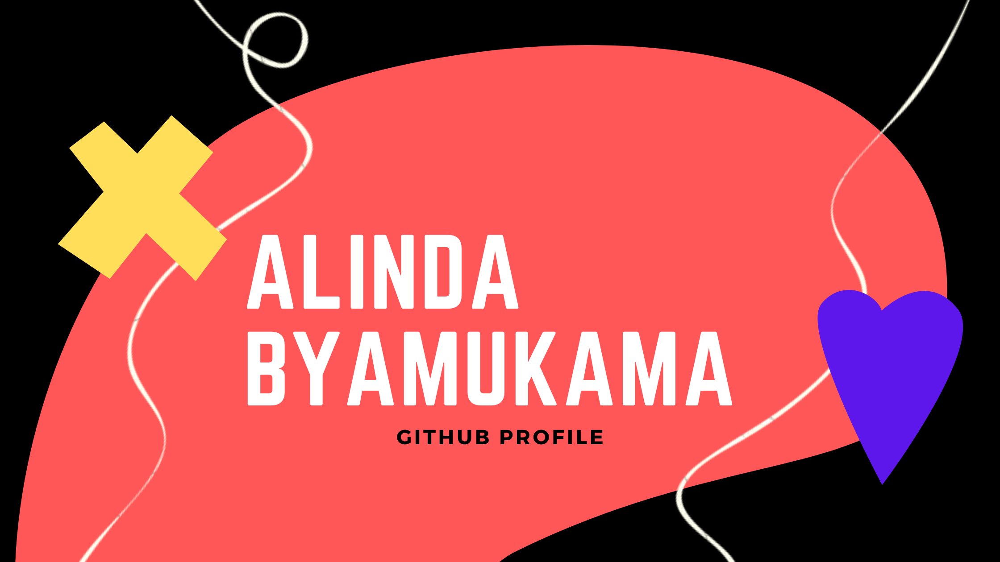

## 👋 Hello there!
My name is Alinda Byamukama, I am a Junior developer based in Kampala - Uganda, with a keen interest in User Experience and User Interface design. 
My current focus is on 🌱growing🌱 my web development and UX/UI design skills so that I can create ✨holistic, user centric, online experiences✨ for people to benefit from and enjoy 😄 

 🌱 I’m currently learning Vanilla JavaScript, CSS & HTML 🌱
 

 🔭 I am working towards being a ✨FullStack Developer✨ with the Outbox Uganda FullStack Online Bootcamp 🔭
 
 (Check out my personal website by clicking on my banner image above.)

 

## &#x1f4c8; GitHub Stats
<!--Anurag Hazra‘s GitHub ReadMe Stats (https://github.com/anuraghazra/github-readme-stats)-->
 
<!-- most used languages -->

<!-- my github stats -->

 

## 📫 Here is where you can find me ...
<!--SOCIAL BADGES-->

 

<!-- Main resource Used to create this readme (https://blog.braydoncoyer.dev/creating-a-killer-github-profile-readme-part-1) -->
<!--
**alindaByamukama/alindaByamukama** is a ✨ _special_ ✨ repository because its `README.md` (this file) appears on your GitHub profile.

Here are some ideas to get you started:

- 🔭 I’m currently working on mastering Vanilla JavaScript by creating various projects.
- 🌱 I’m currently learning JavaScript.
- 👯 I’m looking to collaborate on ...
- 🤔 I’m looking for help with ...
- 💬 Ask me about ...
- 📫 How to reach me: ...
- 😄 Pronouns: ... She/Her
- ⚡ Fun fact: ... 
-->
